# System Architecture

This document describes the end-to-end architecture of Project M&M — Marine
Mapping Validation Framework. It corresponds to Figure 1 in the project charter
and provides implementation-level detail for each stage.

---

## High-Level Pipeline Diagram

```mermaid
flowchart LR
    subgraph S1["Stage 1 · Ground Truth Generation"]
        A1["Deterministic 3D\nSeabed Mesh\n(Blender)"]
        A2["Sensor Trajectory\nDefinition"]
    end

    subgraph S2["Stage 2 · Sensor Simulation"]
        B1["Synthetic LiDAR\nPoint Cloud"]
        B2["Synthetic Sonar\nPoint Cloud"]
    end

    subgraph S3["Stage 3 · Controlled Degradation"]
        C1["Gaussian Positional\nNoise  σ = 0.01–0.05 m\n(IMU jitter)"]
        C2["GNSS Drift\n≤ 2.0 m horizontal"]
        C3["Sea-State Motion\nAmplitude ≤ 0.5 m"]
    end

    subgraph S4["Stage 4 · Fusion Algorithm"]
        D1["Geometric Alignment\n(Open3D ICP)"]
        D2["Map Reconstruction\n(Voxel Fusion)"]
    end

    subgraph S5["Stage 5 · Statistical Validation"]
        E1["RMSE vs\nGround Truth"]
        E2["Reprojection\nError Heatmap"]
        E3["Depth Histogram\nDistribution"]
        E4["KS Test\nD < 0.15"]
    end

    S1 --> S2
    S2 --> S3
    S3 --> S4
    S4 --> S5
    S5 -->|"Parameter tuning\n& scenario iteration"| S1
```



---

## Stage Descriptions

### Stage 1 — Ground Truth Generation

**Purpose:** Produce deterministic 3D geometry and a repeatable sensor trajectory
as the clean reference baseline.

**Key components:**

| Component | Location |
|---|---|
| Seeded scene generation | `scripts/generate_seeded_dual_sensor_scene.py` |
| Batch generation | `scripts/generate_seeded_dual_sensor_batch.py` |
| Real bathymetry import | `scripts/make_scan_ready_real_bathy_scene.py` |
| Path / waypoint generation | `scripts/generate_geometry_path_config.py`, `scripts/path_generation.py` |
| Animated scene creation | `scripts/create_animated_validation_scene.py` |

**Reproducibility:** All scenes accept an integer `seed` parameter. Given the
same seed and config, the geometry and sensor path are identical across runs.

---

### Stage 2 — Sensor Simulation (Custom BLAINDER Fork)

**Purpose:** Cast rays from both sensors against the ground-truth mesh and record
paired LiDAR and sonar point clouds under ideal (non-degraded) conditions.

**Key components:**

| Component | Location |
|---|---|
| Multi-sensor scan orchestrator | `range_scanner/scanners/generic.py` |
| LiDAR ray-caster | `range_scanner/scanners/lidar.py` |
| Sonar detection model | `range_scanner/scanners/sonar.py` |
| Hit data structure | `range_scanner/scanners/hit_info.py` |
| Export formats (CSV/LAS/PLY/HDF5) | `range_scanner/export/` |
| Blender UI panel | `range_scanner/ui/user_interface.py` |

**Sensor pairing:** Both sensors share the same ground-truth mesh and animation
timeline. The LiDAR is above-water (rotating or single-ray mode); the sonar is
below-water (side-scan or 3-D mode). Point clouds are labelled by `sensor_id`
throughout the pipeline.

---

### Stage 3 — Controlled Degradation

**Purpose:** Inject parameterised maritime noise to simulate realistic operational
errors, producing a degraded dataset for fusion testing.

**Key components:**

| Component | Location |
|---|---|
| Gaussian positional noise (IMU jitter) | `range_scanner/error_distribution.py` |
| GNSS drift model | `range_scanner/validation/degradation.py` — `_gnss_offset()` |
| Sea-state heave model | `range_scanner/validation/degradation.py` — `_sea_state_offset()` |
| Acoustic distortion (sonar equation) | `range_scanner/scanners/sonar.py` |
| Degradation application | `range_scanner/validation/degradation.py` — `apply_maritime_degradation()` |

**Noise parameters** (all configurable in JSON trial manifests):

| Parameter | Range | Charter Reference |
|---|---|---|
| `sigma` (Gaussian / IMU jitter) | 0.01–0.05 m | TO2 |
| `gnssDriftMeters` | 0–2.0 m | TO2 |
| `gnssDriftHeadingDegrees` | 0–360° | TO2 |
| `seaStateAmplitudeMeters` | 0–0.5 m | TO2 |
| `seaStatePeriodFrames` | 1–N frames | TO2 |
| `seaStatePhaseDegrees` | 0–360° | TO2 |

See `docs/validation/noise-model-mapping.md` for a detailed explanation of how
each named charter noise type maps to its implementation.

---

### Stage 4 — Fusion Algorithm

**Purpose:** Align the degraded point clouds using blind (no ground-truth)
registration and fuse them into a corrected map.

**Key components:**

| Component | Location |
|---|---|
| Multi-resolution Open3D ICP | `range_scanner/validation/alignment.py` — `align_hits_blind_open3d_icp()` |
| Reference-based correction (oracle) | `range_scanner/validation/alignment.py` — `align_hits_to_reference()` |
| Voxel fusion | `range_scanner/validation/fusion.py` — `voxel_fuse_hits()` |
| Medium-separated fusion | `range_scanner/validation/fusion.py` — `reconstruct_medium_separated_map()` |
| Grid reconstruction | `range_scanner/validation/fusion.py` — `reconstruct_medium_height_grid_map()` |
| Docker container | `Dockerfile` |

**ICP configuration (default):**

| Parameter | Value |
|---|---|
| Voxel sizes (cascade) | 0.30 m → 0.12 m → 0.05 m |
| Max correspondence distances | 1.50 m → 0.50 m → 0.18 m |
| Max iterations per level | 50 → 30 → 20 |
| Fitness gate | 0.10 |
| Inlier-RMSE gate | 0.40 m |

The **TO4 official fusion output** is `blind_post_processing_fusion` — the blind
ICP-aligned voxel fusion result, which is the operationally realistic output
(no ground-truth access assumed).

---

### Stage 5 — Statistical Validation Layer

**Purpose:** Quantitatively compare fusion outputs to the ground-truth mesh and
to real-world reference distributions, and produce human-readable visualisations.

**Key components:**

| Component | Location |
|---|---|
| Surface-distance metrics (RMSE, MAE, P95) | `range_scanner/validation/evaluation.py` |
| KS test and histogram comparison | `range_scanner/validation/evaluation.py` — `compare_depth_distributions()` |
| Error reduction computation | `range_scanner/validation/evaluation.py` — `compute_error_reduction()` |
| Spatial error samples (heatmap data) | `range_scanner/validation/evaluation.py` — `evaluate_points_against_targets()` |
| Report assembly and write | `range_scanner/validation/evaluation.py` — `build_validation_report()`, `write_validation_report()` |
| RMSE bar chart | `scripts/visualize_validation_report.py` — `plot_rmse_comparison()` |
| Reprojection error heatmap | `scripts/visualize_validation_report.py` — `plot_reprojection_heatmap()` |
| Depth distribution histogram | `scripts/visualize_validation_report.py` — `plot_depth_histogram()` |

**Acceptance thresholds** (see `docs/validation/methodology.md` for full detail):

| TO | Criterion | Threshold |
|---|---|---|
| TO3 | KS statistic D | < 0.15 |
| TO3 | Max bin density deviation | < 10% |
| TO4 | Positional degradation baseline | ≥ 2.0 m |
| TO4 | Post-fusion RMSE (blind ICP) | ≤ 0.15 m |
| TO4 | Error reduction | ≥ 80% |
| TO5 | Wall-clock time | ≤ 10 min |
| TO5 | Peak memory | ≤ 8 GB |

---

## Batch Workflow Runners

The `scripts/` directory provides headless entry points that drive the full
pipeline without opening the Blender GUI:

| Script | Purpose |
|---|---|
| `run_fixed_scene_validation_batch.py` | Run multiple trials on a fixed scene; aggregate CSV/JSON summary |
| `run_fixed_scene_validation_trial.py` | Run a single trial inside Blender (called by the batch runner) |
| `run_animated_path_validation.py` | Create animated scenes, run batch, compute acceptance |
| `run_pose_then_noise_validation.py` | Pose sweep → select top poses → noise sweep |
| `run_multi_seed_pose_then_noise_validation.py` | Repeat pose/noise workflow across multiple seeded scenes |
| `visualize_validation_report.py` | Generate the three demo-component PNGs from any report JSON |

---

## Data Flow Summary

```
Blender scene (.blend)
    │
    ▼
generate_seeded_dual_sensor_scene.py  ──► deterministic geometry + sensor poses
    │
    ▼
run_fixed_scene_validation_trial.py   ──► scan_multi_sensor() inside Blender
    │
    ├── error_distribution (Gaussian noise)
    ├── degradation.apply_maritime_degradation (GNSS drift + sea-state)
    ├── alignment.align_hits_blind_open3d_icp (blind ICP)
    ├── fusion.voxel_fuse_aligned_hits (voxel map)
    └── evaluation.evaluate_points_against_targets (metrics + heatmap data)
    │
    ▼
*_report.json  ──► visualize_validation_report.py  ──► 3 PNGs
                │
                └─► run_fixed_scene_validation_batch.py ──► aggregate CSV
```

---

## Coordinate System Note

Blender uses a right-handed coordinate system with Z-up. The sensor simulation
and degradation models operate entirely within Blender world coordinates.

## ICP Alignment: Translation-Only Design

The ICP alignment in `alignment.py` is constrained to **translation-only**.
After each ICP level the rotation block of the 4×4 transformation is coerced
back to the identity matrix via `_coerce_translation_transform()` (line 347),
so only the translation vector `t = [dx, dy, dz]` is retained.

**Why translation-only and not full 6-DOF ICP?**

1. **The degradation model is translation-only.**  `degradation.py:_gnss_offset()`
   adds a purely XY displacement that grows linearly with time; `_sea_state_offset()`
   adds a Z-axis sinusoidal heave. Neither introduces any rotational component.
   Allowing ICP to also recover rotation would mean fitting a degree of freedom
   that has no physical counterpart in the modelled error sources.

2. **Rotation would absorb real bathymetric signal.**  On a sloped or textured
   seabed, point-to-point ICP will tend to resolve remaining residuals by tilting
   the source cloud to match the target surface.  That tilt is indistinguishable
   from a genuine heading change, so a full 6-DOF correction would silently
   distort the recovered geometry rather than correct the sensor position.

3. **Heading is held constant in the Blender animation path.**  The platform
   follows a lawnmower or straight-push trajectory with fixed heading during
   each frame interval.  Any apparent heading change between frames would
   be an artefact of incomplete scan overlap, not actual vessel rotation.

4. **Full 6-DOF would require heading-sensor fusion.**  Real-world blind
   alignment of GNSS-drifted data without an IMU or compass reference cannot
   reliably separate translational drift from platform rotation.  Making that
   separation here would introduce false precision absent from the physical model.

The practical consequence is that the blind-corrected RMSE metrics measure how
well the pipeline recovers the **translational** component of positional
degradation, which is the component the degradation model introduces and the
component the charter's TO4 criterion targets.
